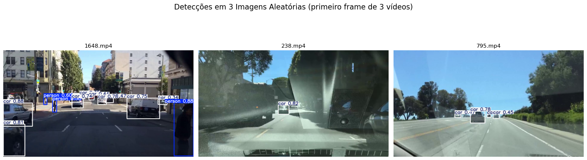

#  Introdução a Redes Neurais (UNIFESP)

## Projeto 1: 
Este projeto consiste na implementação de uma rede neural do tipo MLP (Multi-Layer Perceptron) em Python, sem o uso de bibliotecas próprias para aprendizado de máquina, como PyTorch ou TensorFlow. Após a implementação, diferentes modelos foram desenvolvidos para resolver problemas de classificação e regressão, com análise e ajustes de hiperparâmetros.

### Objetivos 
1. Implementar uma rede neural MLP:
   - Construir a arquitetura base em Python, do zero.
   - Implementar as funções de ativação (e.g., Sigmoid, Softmax).
   - Calcular gradientes usando backpropagation.
   - Incluir funcionalidades como momento e taxa de aprendizado.

2. Desenvolver modelos:
   - Um modelo para classificação de dados.
   - Um modelo para regressão. 

3. Avaliar hiperparâmetros
   - Variar o número de camadas ocultas e neurônios por camada.
   - Testar diferentes taxas de aprendizados(eta) e fatores de momentum

## Projeto 2: 
Neste projeto, foi aplicada uma rede neural não supervisionada utilizando a abordagem Self-Organizing Map (SOM). O foco principal foi explorar a detecção de padrões em dois datasets distintos: imagens médicas de raios-X de tórax para classificação de pneumonia e dígitos manuscritos representados por matrizes de pixels. A rede foi utilizada para identificar clusters, detectar outliers e avaliar a homogeneidade dos agrupamentos. Além disso, foram realizadas análises sobre como variações nos parâmetros do modelo impactam a qualidade dos padrões detectados. Este projeto destaca a aplicabilidade do modelo SOM em cenários de aprendizado não supervisionado.

### Objetivos Específicos

1. **Seleção e preparação dos datasets:**
   - Dois datasets foram utilizados:
     - **Imagens médicas de raios-X de tórax:** Este conjunto de dados foi explorado para identificar padrões relacionados à classificação de pneumonia.
     - **Dígitos manuscritos:** Representados por matrizes de pixels, este dataset foi utilizado para explorar a capacidade do modelo SOM em agrupar representações visuais.
   - Antes da aplicação do modelo, os dados passaram por etapas de limpeza e preparação para garantir consistência e qualidade.

2. **Aplicação da rede neural SOM:**
   - Foi implementado um modelo SOM para realizar aprendizado não supervisionado nos dois datasets.
   - A rede foi configurada para identificar clusters relevantes, detectar outliers e mapear padrões nos dados.

3. **Análise dos padrões detectados:**
   - Os agrupamentos gerados pela rede foram avaliados quanto à sua homogeneidade e relevância.
   - Foram identificados clusters que representam grupos similares dentro dos dados, além da detecção de possíveis outliers.

4. **Exploração de variações nos parâmetros do modelo:**
   - Diferentes configurações do modelo SOM foram testadas para avaliar seu impacto na qualidade dos resultados:
     - **Tamanho do grid:** A estrutura da grade foi ajustada para observar como o número de células influencia os agrupamentos.
     - **Número de neurônios:** O tamanho da rede foi variado para analisar sua capacidade de generalização.
     - **Taxa de aprendizado:** Diferentes valores foram experimentados para verificar a velocidade e estabilidade do treinamento.
     - **Sigma (função vizinhança):** O parâmetro sigma foi ajustado para explorar como ele afeta a interação entre os neurônios durante o treinamento.

## Projeto 3: 
Neste projeto foram treinados modelos Variational Autoencoders (VAEs) utilizando os datasets rotulados MNIST e Fashion MNIST. A estratégia envolveu ajustar a topologia do modelo com base na função de custo, visando não apenas uma boa reconstrução das imagens, mas também uma análise detalhada do espaço latente. A exploração desse espaço possibilitou avaliar a formação de clusters, a separação de rótulos e a variância explicada, além de investigar se os rótulos das amostras podem enviesar a distribuição dos dados.

### Objetivos Específicos

1. **Preparação dos Dados:**  
   - Utilizar os datasets MNIST e Fashion MNIST, garantindo que os dados sejam limpos e padronizados para o treinamento dos modelos.

2. **Treinamento e Ajuste dos Modelos VAE:**  
   - Configurar e treinar os VAEs, ajustando a topologia do modelo com base na função de custo.  
   - Refinar a arquitetura (como número de camadas e dimensões do espaço latente) para otimizar a reconstrução das imagens.

3. **Exploração e Análise do Espaço Latente:**  
   - Avaliar a formação de clusters e a separação dos rótulos dos dados dentro do espaço latente.  
   - Calcular a variância explicada pelos componentes latentes.  
   - Investigar a possibilidade de os rótulos das amostras influenciarem (ou enviesarem) a organização do espaço latente.

4. **Visualização e Interpretação:**  
   - Visualizar os padrões obtidos no espaço latente para facilitar a interpretação dos resultados.  
   - Comparar as representações geradas pelos modelos, destacando a eficácia dos VAEs na reconstrução de imagens e na extração de características latentes.

## Projeto 4: 
Neste projeto, foram treinados modelos LSTM para classificar séries temporais, onde o modelo recebe uma janela contínua de dados e, com base nos padrões dinâmicos observados, determina a categoria correspondente. A aplicação focou na classificação de segmentos de ECG, distinguindo entre condições normais, arritmias e outras variações.

### Objetivos Específicos

1. **Preparação dos Dados e Segmentação:**
   - Coletar e pré-processar séries temporais, com ênfase em sinais de ECG.
   - Segmentar os dados em janelas que permitam a captura dos padrões temporais relevantes para a análise.

2. **Desenvolvimento e Treinamento do Modelo LSTM:**
   - Construir e treinar redes LSTM para interpretar as janelas de dados.
   - Ajustar a topologia das camadas LSTM, o número de neurônios e aplicar mecanismos de regularização com o objetivo de otimizar a identificação dos padrões dinâmicos.

3. **Classificação e Análise dos Padrões Temporais:**
   - Utilizar os modelos treinados para classificar os segmentos de ECG em categorias como normal, arritmia e outras.
   - Avaliar a capacidade dos modelos em identificar corretamente os padrões significativos presentes nos sinais temporais.

4. **Validação e Otimização:**
   - Testar diferentes configurações das redes LSTM e comparar seu desempenho na classificação.
   - Analisar os resultados através de métricas específicas para séries temporais, destacando a eficácia das redes LSTM na extração de informações dinâmicas.
   - 
## Projeto 5: 

Este projeto teve como objetivo implementar e avaliar diferentes arquiteturas de redes neurais convolucionais (CNNs) para a classificação de imagens do dataset MNIST. Foram exploradas cinco topologias clássicas: LeNet, AlexNet, VGG, GoogLeNet e ResNet. A análise focou no impacto da profundidade das redes, número de filtros e hiperparâmetros no desempenho. Além disso, uma rede MLP previamente treinada foi utilizada como referência para comparação com a melhor CNN em termos de acurácia e número de parâmetros.

## Objetivos Específicos

1. **Implementação de Arquiteturas CNN:**
   - As seguintes arquiteturas foram implementadas e treinadas no dataset MNIST:
     - **LeNet:** Uma arquitetura pioneira, ideal para tarefas simples como o MNIST.
     - **AlexNet:** Rede mais profunda que introduziu avanços como ReLU e dropout.
     - **VGG:** Conhecida por sua simplicidade e uso de pequenas janelas de convolução.
     - **GoogLeNet:** Rede mais complexa com módulos Inception.
     - **ResNet:** Introduziu conexões residuais para facilitar o treinamento de redes profundas.
   - Cada arquitetura foi ajustada para explorar o impacto da profundidade, número de filtros em cada camada e outros hiperparâmetros.

2. **Treinamento e Avaliação dos Modelos:**
   - Os modelos foram treinados no dataset MNIST, que contém 60.000 imagens de treino e 10.000 imagens de teste (28x28 pixels, escala de cinza).
   - Foram utilizados diferentes hiperparâmetros, como taxa de aprendizado, otimizadores (SGD, Adam), regularização (dropout) e tamanho do batch.
   - A acurácia foi usada como métrica principal para identificar os dois melhores modelos.

3. **Análise Detalhada dos Melhores Modelos:**
   - Para os dois modelos com melhor desempenho:
     - Foi gerada a matriz de confusão para avaliar o desempenho por classe.
     - Uma comparação detalhada das arquiteturas foi realizada, destacando diferenças na profundidade, número de filtros e eficiência na classificação.

4. **Comparação com Rede MLP:**
   - Uma rede MLP previamente treinada no mesmo dataset foi usada como referência.
   - A comparação incluiu:
     - **Acurácia:** Para avaliar a capacidade preditiva.
     - **Número de parâmetros:** Para analisar a eficiência computacional.
   - As vantagens e limitações das abordagens CNN e MLP foram destacadas.

## Projeto Final: Sistema de Detecção de Objetos com YOLOv8 em Câmeras Veiculares

Este projeto teve como objetivo desenvolver e avaliar um sistema de detecção de objetos utilizando redes neurais convolucionais (CNNs), com foco no modelo YOLOv8 (*You Only Look Once*), aplicado a vídeos capturados por câmeras embarcadas em veículos. O sistema foi projetado para identificar e localizar automaticamente elementos presentes em cenários de tráfego, como pedestres, veículos e sinais de trânsito, demonstrando a eficiência do modelo em situações reais.

### Objetivos Específicos

1. **Implementação do Modelo YOLOv8:**
   - O modelo YOLOv8, pré-treinado no dataset COCO, foi utilizado como base para a detecção de objetos.
   - Sua arquitetura modular, composta por:
     - **Backbone:** Para extração eficiente de características.
     - **Neck:** Para agregação e fusão das características extraídas.
     - **Head:** Para realizar as predições finais (localização e classificação dos objetos).
   - A integração com ferramentas como OpenCV e FFmpeg permitiu o processamento eficiente dos vídeos e a visualização dos resultados diretamente no ambiente de desenvolvimento.

2. **Avaliação em Dataset BDD100K:**
   - Foi utilizado o dataset BDD100K, que contém vídeos capturados em ambientes urbanos, para avaliar o desempenho do modelo em condições reais.
   - O modelo foi testado em:
     - **3 frames aleatórios:** Para validação pontual da precisão na detecção.
     - **3 vídeos completos:** Para avaliar o desempenho do YOLOv8 ao processar sequências completas.

3. **Análise de Desempenho:**
   - Foram analisadas métricas como:
     - **Precisão:** Capacidade do modelo de identificar corretamente os objetos relevantes.
     - **Velocidade:** Avaliação da performance em tempo real, mesmo em vídeos de alta resolução.
   - A robustez do modelo foi avaliada considerando diferentes condições de tráfego e escalas dos objetos.

4. **Aplicabilidade Prática:**
   - O sistema desenvolvido demonstra a aplicabilidade do YOLOv8 em sistemas embarcados para visão computacional.
   - Exemplos incluem:
     - Monitoramento veicular.
     - Sistemas avançados de assistência ao motorista (ADAS).
     - Análise automatizada de tráfego urbano.

### Resultados

- O modelo YOLOv8 mostrou-se altamente eficaz para a tarefa de detecção em tempo real, combinando precisão e velocidade.  
- Foi capaz de identificar pedestres, veículos e sinais de trânsito em cenários dinâmicos e variados, mesmo sob condições desafiadoras como mudanças de iluminação e densidade variável do tráfego.  
- A arquitetura modular do YOLOv8 contribuiu para uma extração eficiente das características e predições rápidas.

### Conclusão

Este projeto demonstrou que o YOLOv8 é uma solução robusta para sistemas de visão computacional aplicados a câmeras veiculares. Sua capacidade de identificar objetos relevantes em cenários urbanos dinâmicos reforça sua aplicabilidade prática no campo da visão computacional. A integração com ferramentas modernas possibilitou um fluxo eficiente desde o processamento dos vídeos até a visualização dos resultados, evidenciando como redes neurais convolucionais modernas podem resolver problemas práticos com alta eficácia.

##

